# Welcome

## DAB Porfolio
- Repo : `.`
- [Documentation](https://doug-pires.github.io/quotes_dab/) in GitHub Pages

## dbx portfolio
- Repo : [ check the repo here](https://github.com/doug-pires/quotes_dbx)
- [Documentation](https://doug-pires.github.io/quotes_dbx/) in GitHub Pages

---

# Purpose

I trust that you can glean valuable insights from this portfolio and apply them to real-world projects. Within these materials, I have endeavored to present essential principles, best practices, and guidelines that prove beneficial when engaged in project development as a Data Engineer, Data Analyst, or Analytics Engineer.

In accordance with the **"Pragmatic Starter Kit"** outlined in "The Pragmatic Programmer" book:
1. Version Control
2. Regression Testing
3. Full Automation

With that said let's dive in...🏊‍♂️

## What are you going to find here?

- Prioritize Version Control.
- Embrace Automation (e.g., GitHub Actions, pre-commit hooks, Azure DevOps).
- Apply Functional Programming in Data Engineering projects.
- Utilize Python **typing hints** for clarity and maintainability.
- Incorporate **Docstrings** in Python Functions (e.g., Google or Numpy style).
- Simplify documentation with **MkDocs**, **MkDocs Materials**, and Community plugins, deployed on **GitHub Pages**.
- Recognize the Importance of **Design Docs** and **RFCs** in Data Projects.
- Maintain well-formatted code with sorted imports (**Isort** and **Black**/**Blue** can help).
- Stress the Importance of Testing, leveraging **Pytest** and its plugins for `fixtures`, `markers`, and `conftest` files.
- Use the library `chispa` to test `pyspark` dataframes
- Implement the **Given-When-Then** pattern derived from **Behavior-Driven Development (BDD)** in test cases.
- Monitor code coverage with **pytest-cov** and **coverage** tools.
- Follow the **DRY Principle** (Don't Repeat Yourself) to avoid redundancy in your code.
- And many more +++

## Technology Tools

- Utilize `Poetry` for dependency management and packaging.
- Leverage the **Databricks** stack to streamline the process of creating scalable data engineering projects in your local IDE (in my case, VSCode) and running them remotely.
- Explore how **dbx** and the newest released **Databricks Asset Bundles** make it easy to manipulate Databricks Assets.
- Experience the powerful combination of **Delta Live Tables** and **Autoloader**, a match made in heaven for data ingestion.

To sum up, there is no jack of all trades, always you will need specific tools to accomplish a goal.
However good principles applied and well solidified, avoid big headaches in the future, be for a change request, add new use cases, transfer of ownership or onboarding a new joiner.

---

# Pics to give you a flavor

## Jobs in CI/CD

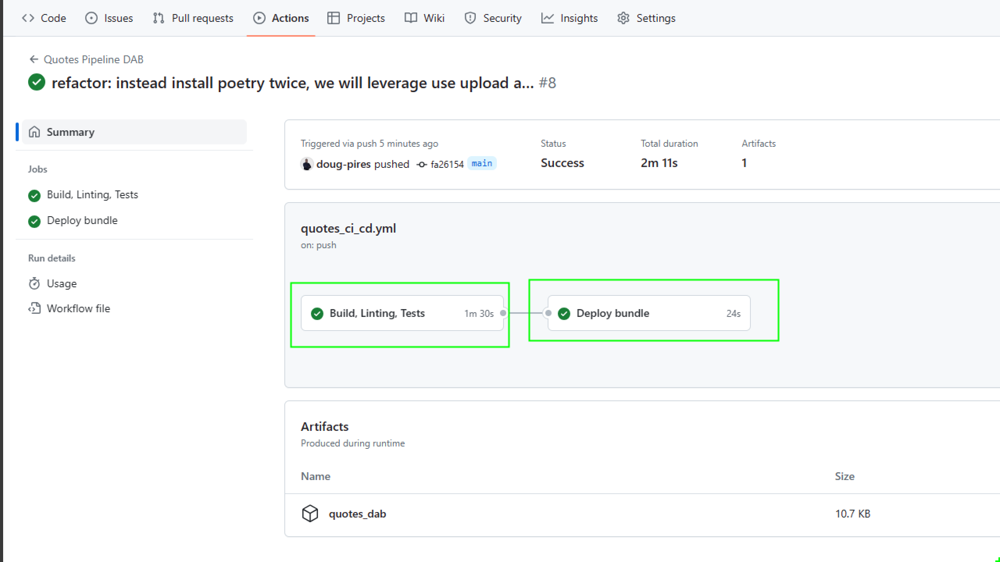

---
## Coverage
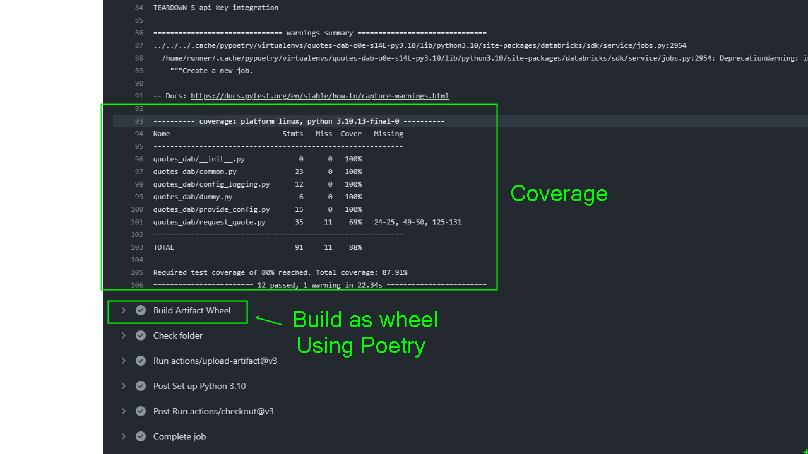

---
## Deploy
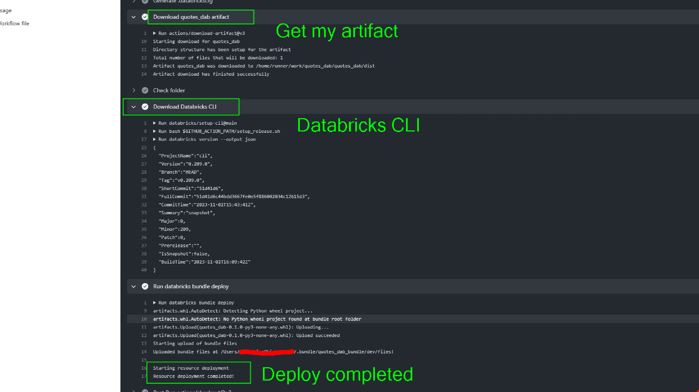
---
## Graphic and Lineage from Delta Live Tables
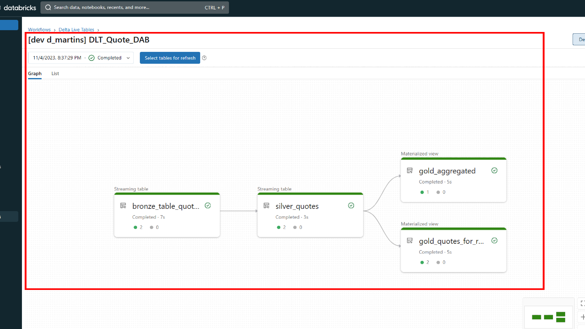
---
## Workflow in Databricks
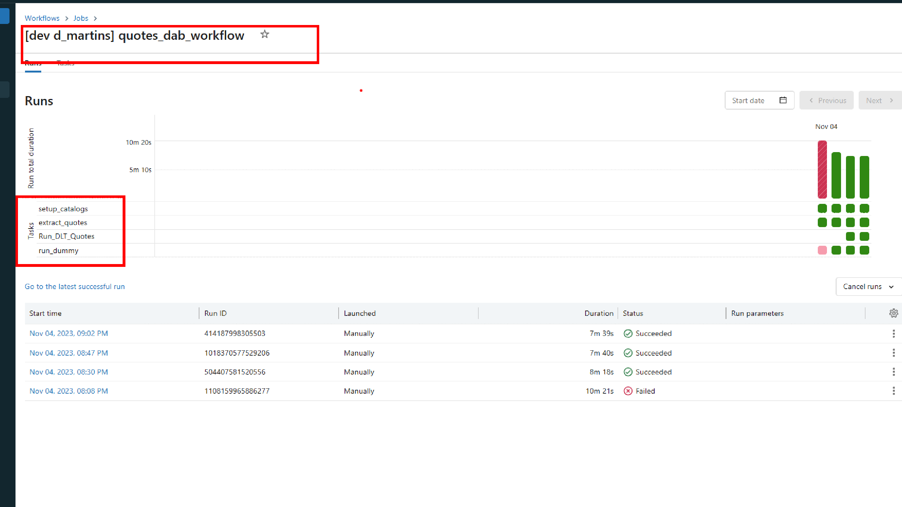
---
## The quote
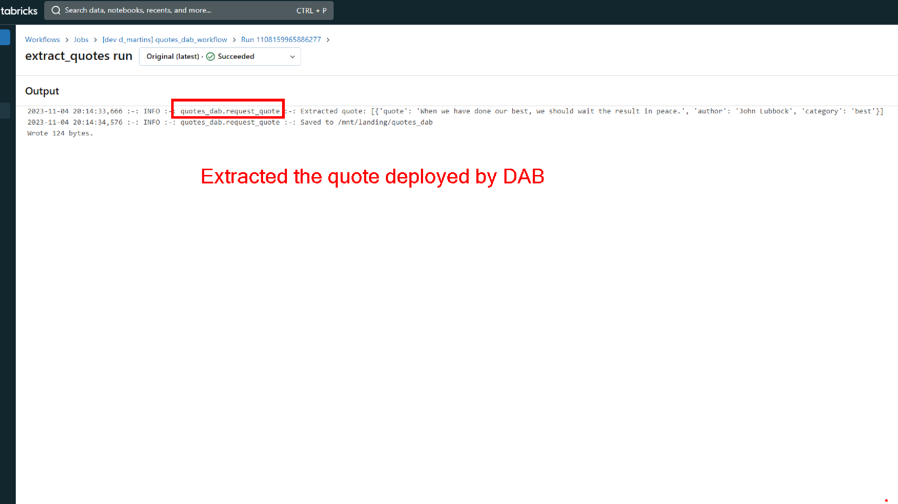

---
## Landing directories and json files
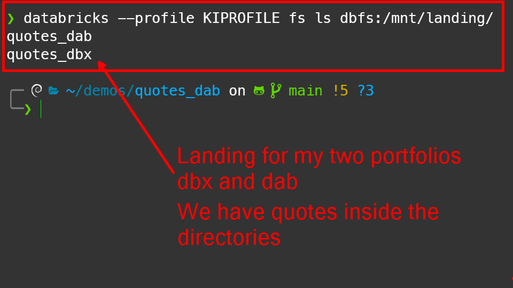
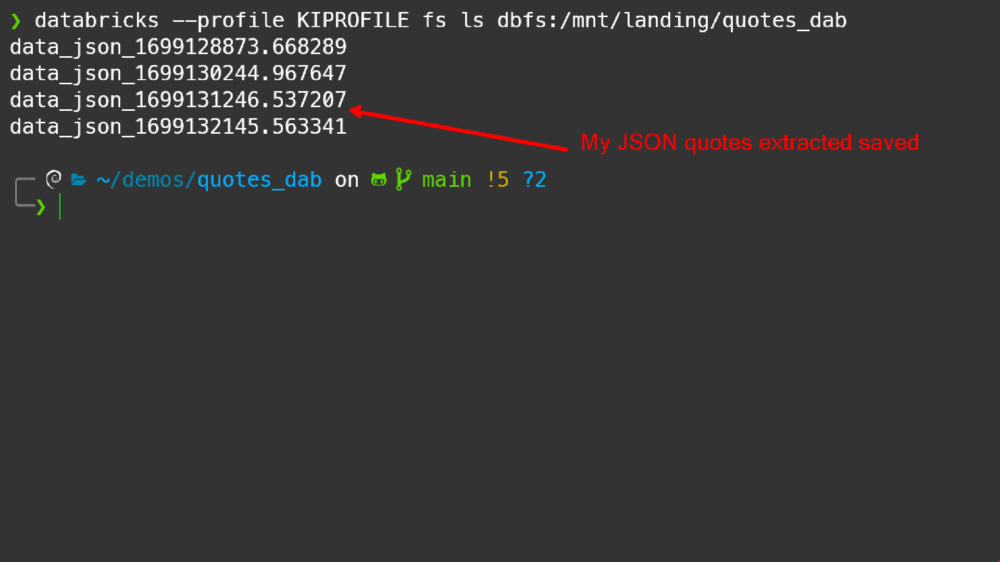

---
## Catalog and Delta Tables
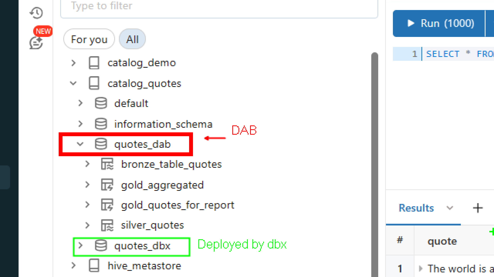
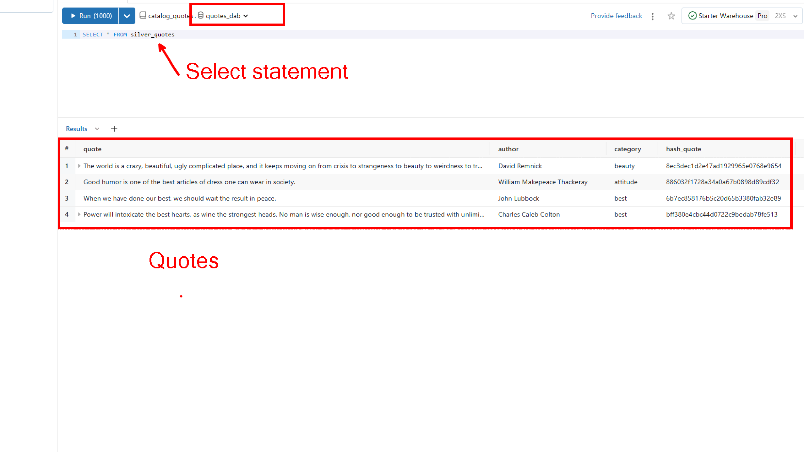
---
## Delta Table Properties defined in the pipeline
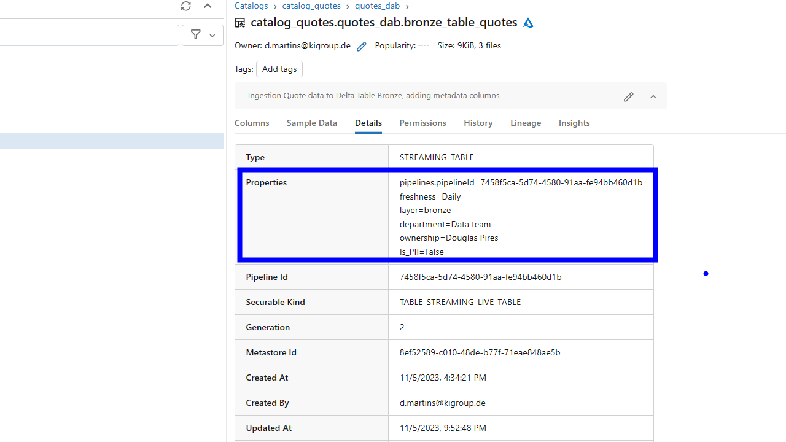

---

# Appendix

This is a showcase how we can use the same source code and deploy into Databricks using different approaches (dbx or dab), witnessing the benefits of build modular, reusable code, relying on principles and best practices.

**Bear in mind**:
- Databricks recommends uses dab ( Databricks Asset Bundles ), you can learn how to migrate your dbx projects to dabs readind the [migration guidance](https://docs.databricks.com/en/archive/dev-tools/dbx/dbx-migrate.html)
- I am running all the pipeline as a user, the ideal would be [use Service Principal](https://medium.com/@abraham.pabbathi/automating-jobs-in-azure-databricks-with-service-principals-2e847d107961)
- I did not schedule the workflows, I was running manually.
- The documentation was published in Github Pages, however you can use other hosts, such as [Read the Docs](https://docs.readthedocs.io/en/stable/tutorial/index.html)
- See the session *references* in [documentation](https://doug-pires.github.io/quotes_dab/) to find useful articles.

> Special thanks to KI Performance
---

> Enjoy  💕 💞
