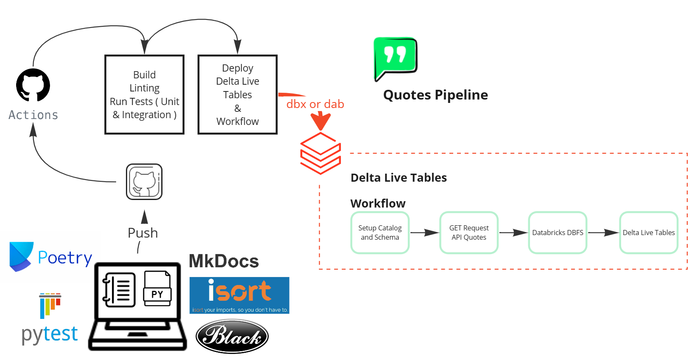

# Design Docs

## Overview

Build a **simple** data pipeline that extract famous quotes, process it and save on storage.

- 🎯Goals: Deploy **Delta Live Tables** & **Workflow** pipeline into Databricks using {{ commands.project_example_dab }}
- ⚠️ Non-Goals : Be a complex pipeline
- 🌟 Milestone: Follow best practices and principles
- 🫂 Main Audience: Jr and Mid Data Enginners, and others interested parties
- 🔥 Bonus : YAML file for CI/CD in GitHub Actions

## Requirements

| Requirement No | Requirement Summary                                      |
| -------------- | -------------------------------------------------------- |
| 1              | Use dab (Databricks Asset Bundles)                       |
| 2              | Apply Unit Testing on Python Code                        |
| 3              | Test Coverage be higher than 80%                         |
| 4              | Use Development Mix Mode ( Notebooks and Python Scripts) |
| 5              | Self document code using Docstrings                      |
| 6              | Design a Documentation in GitHub Pages                   |


## Design Considerations

### Data sources
It's an API hosted by [API Ninjas]([API Ninjas | Build Real Applications with Real Data (api-ninjas.com)](https://api-ninjas.com/)) and the user should sign up to get an API Key.

You can add the API KEY as `secrets` in Databricks-Backed Scope.

The commands:
```bash
databricks secrets create-scope SCOPE_NAME
databricks secrets put-secret SCOPE_NAME SECRET_NAME
```

Then will prompt a screen to add the secret.

### Data Ingestion
Python code to request the quote and each request will get a new random quote. We can consider the  Data Volume small, being not a challenge in that use case.

### Data Storage
For the sake of simplicity will be stored in DBFS

### Data Processing
For further processing we will use [Delta Live Tables]([Configure pipeline settings for Delta Live Tables | Databricks on AWS](https://docs.databricks.com/en/delta-live-tables/settings.html))

- [Autoloader](https://learn.microsoft.com/en-us/azure/databricks/ingestion/auto-loader/) will ingest incrementally to a `streaming` Bronze Table, adding some metadata information to track the batch and auditing purposes.
- Silver table we will hash some columns to uniquely identify a quote.
- Gold Tables for aggregation and report purposes.

### Data Consumption
No Data Consumers waiting in downstream tools

### Data Operations
The orchestration will be done by Databricks Workflows

### Data Governance
Out-of-Scope ❌

### Data Security
Out-of-Scope ❌


## Tech Solution

### Workflow

#### Architecture




### Manage Metadata and Build Process:
- [Poetry](https://python-poetry.org/)

### Deploy Databricks Assets
- [Databricks Asset Bundles]([What are Databricks Asset Bundles? | Databricks on AWS](https://docs.databricks.com/en/dev-tools/bundles/index.html))

### Python Libraries:
 - pyspark
 - delta-spark
 - databricks-sdk
 - requests


#### Test
 - [pytest](https://pypi.org/project/pytest/)
 - [chispa]([MrPowers/chispa: PySpark test helper methods with beautiful error messages (github.com)](https://github.com/MrPowers/chispa))
 - [pytest-cov](https://pypi.org/project/pytest-cov/)
 - [pytest-mock](https://pypi.org/project/pytest-mock/)

#### Linters
 - [isort](https://pypi.org/project/isort/)
 - [black](https://pypi.org/project/black/)

#### Documentation
 - [mkdocs](https://pypi.org/project/mkdocs/)
 - [mkdocs-material](https://pypi.org/project/mkdocs-material/)

